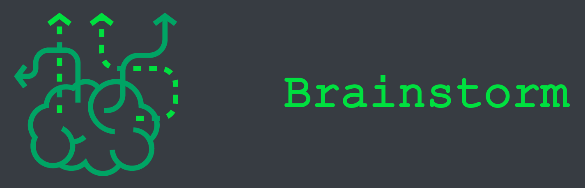

## Сайт-визитка команды Brainstorm
### Доступен по ссылке: https://brainstorm-team.herokuapp.com/

### Локальная сборка проекта

> необходимо наличие пакетного менеджера `npm`

Для локальной сборки и запуска проекта в директории с проектом выполнить следующие команды `npm`

* `npm install` - подгружаем зависимости указанные в файле `package.json`
* `npm start` - запускаем сервер (порт задан в файле `index.js`)

## Команда
* Колотовкин Максим (капитан) [github/maxim218](https://github.com/maxim218)  
* Кирьяненко Алексадр [github/kiryanenko](https://github.com/kiryanenko)  
* Куклина Нина [github/akenoq](https://github.com/akenoq)
* Прохорова Злата [github/LacieLiddell](https://github.com/LacieLiddell)  

## О проекте

Для реализации сайта были использованы JS (как во frontend, так и на backend части (Node.js + Express)), CSS и
фреймворк Bootstrap.

| Файл | Назначение |
| --- | --- |
| package.json | Файл с зависимостями и скриптами для пакетного менеджера `npm` |
| index.js | Серверный JS: Node.js + Express для раздачи статики |
| static/dist/css/main.js | Клиентский JS |
| static/dist/js/main.css | Стили CSS |
| static/index.html | Веб-страница HTML |


### JS

#### Клиентская часть

Для того чтобы материалы сайта появились перед пользователем сразу прогруженными на клиентском JS
обрабатывается событие `onload` на `window`. Оно срабатывает, когда загружается вся страница, включая ресурсы на ней 
Таким образом, все содержимое, изначально скарытое (атрибут `hidden`) от пользователя, 
становится доступным (`document.querySelector("header").hidden = false;`).
> см. static/dist/js/main.js

Для того чтобы по нажатию на логотип команды обновлялась страница
к элементам страницы `logo-img` и `title-team` применен код: `onclick="location.reload();`

#### Серверная часть

Для реализации раздачи статического контента с сервера написан код на Node.js
с использованием фреймворка Express

> см. index.js

### CSS

Использовался для определения стилей сайта:
* фон страницы и элементов
* расположения и размеров элементов и шрифтов
* подключен шрифт `Courier New`, для его кроссбраузерного отображения
ресурсы шрифта находятся файла `static/dist/fonts/cour.ttf`

> см. static/dist/css/main.css

Стили подключаются к вебстранице 
```html
    <link href="dist/css/main.css" rel="stylesheet">
```

### Фреймворк Bootstrap

Для реализации адаптивной верстки использовался фрейворк Bootstrap 4.
Также фреймворк, а именно его компонент Carousel, использовался для анимации переходов между блоками с информацией об участниках.

Внутри компонента находятся Carousel-блоки для анимации `<div class="carousel-item">` - 4 штуки.
В каждом из них наш блок `<div class="article">` с информацией об участнике и собственными стилями из `main.css`

Для отображения необходимого контента в нужном стиле некоторые стили Bootstrap компонента
были перекрыты собственными стилями.

Например перекрываем стили клавиш навигации "вперед/назад" компонента Carousel.

```html
<a class="carousel-control-prev nav-button-redefine" href="#team-carousel" role="button" data-slide="prev">
```

```css
/* !important позволяет гарантировать приоритет стиля */
.nav-button-redefine {
    align-items: initial !important;
    top: 8em !important; /* Устанавливаем отступ от верхней границы родительского блока */
    height: 100px; /* Небольшая фиксированная высота, до этого была излишняя */
}
```
